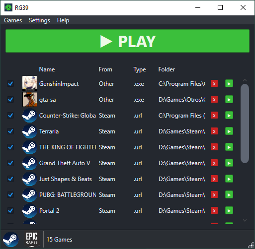

# Random Game Launcher
[](https://github.com/IgnacioVeiga/RandomGameLauncher/releases/latest/download/RandomGameLauncher.zip)


<div>
  <span>English</span> / <a href="README_es.md">Español</a>
</div></br>

It allows you to build a list of installed games and launch one at random.

## Screenshots


***

## Functionalities
- Loads Steam and Epic Games libraries.
- Manually loads executables.
- Removes individual items from the list.
- Clear the list.
- Detects the location of `Steam` and `Epic Games Store` automatically.
- Saves manually added games to `%LocalAppData%\RandomGameLauncher\list.json`.
- Shows icons of executables (manual entries).
- Allows marking which items participate without removing them.
- Supports launch parameters for manually added games.
- Prevents repeated random picks until a cycle is complete.
- Filters games not found when loading the list.
- Allows sorting the list.
- English and Spanish language.

## To do
- Show game cover art.
- Use custom themes.
- Group marked games in different configurations.
- Check for updates.
- Verify operation with more Epic Games Store titles.

***

## How to use
When the program starts, it tries to load installed Steam and Epic Games titles. It also loads manual entries from `%LocalAppData%\RandomGameLauncher\list.json` (migrating legacy `list.json` from old location when present).

To add a manual game, go to `Games` > `Add game`, choose the executable and (optionally) launch arguments.

***

## Required
- Windows 7 or higher (recommended Windows 10/11) x64.
- .NET SDK 8 (LTS) to compile.
- .NET Desktop Runtime 8 (LTS) to run.

***

## Dependencies
### Frameworks
- Microsoft.NETCore.App
- Microsoft.WindowsDesktop.App.WPF

### Packages
- System.Drawing.Common
- GameFinder

***

## Languages
For adding/modifying languages, I recommend the **Visual Studio 2022** extension `ResX Manager`.
Language `.resx` files are in `RandomGameLauncher/Resources/Language/`.

***

## Documentation (English)
- [Architecture](docs/en/ARCHITECTURE.md)
- [Development](docs/en/DEVELOPMENT.md)
- [Release process](docs/en/RELEASE.md)
- [Roadmap](docs/en/ROADMAP.md)

## Documentation (Spanish)
- [Arquitectura](docs/es/ARCHITECTURE.md)
- [Desarrollo](docs/es/DEVELOPMENT.md)
- [Proceso de release](docs/es/RELEASE.md)
- [Roadmap](docs/es/ROADMAP.md)

***

## Release (GitHub Actions, beginner-friendly)
A release is created **only** when you push a Git tag that starts with `v`.

Example:
```bash
git tag v1.0.0
git push origin v1.0.0
```

After that, GitHub Actions runs the `Release` workflow and automatically:
1. Restores and tests the project.
2. Publishes the app for `win-x64`.
3. Creates `RandomGameLauncher.zip` and `RandomGameLauncher.zip.sha256`.
4. Creates a GitHub Release and uploads both files.

***

## Compile
Compile via **Visual Studio 2022**.
You can also run `dotnet build` from terminal (cmd/powershell) in repository root and check `RandomGameLauncher/bin/`.

***

## Contribute
Fork the repository and create a pull request with your changes.
