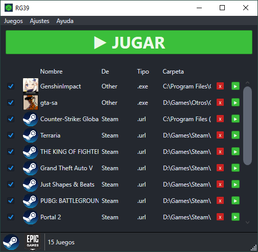

# Random Game Launcher
[](https://github.com/IgnacioVeiga/RandomGameLauncher/releases/latest/download/RandomGameLauncher.zip)


<div>
  <a href="README.md">English</a> / <span>Español</span>
</div></br>

Permite crear un listado de videojuegos instalados y ejecutar uno al azar.

## Capturas de pantalla


***

## Funcionalidades
- Carga la biblioteca de Steam y Epic Games.
- Carga ejecutables manualmente.
- Elimina elementos individualmente.
- Limpia la lista.
- Detecta automáticamente la ubicación de `Steam` y `Epic Games Store`.
- Guarda juegos manuales en `%LocalAppData%\RandomGameLauncher\list.json`.
- Muestra iconos de ejecutables (entradas manuales).
- Permite marcar qué juegos participan sin quitarlos de la lista.
- Soporta parámetros de lanzamiento para juegos manuales.
- Evita repeticiones hasta completar un ciclo.
- Filtra juegos no encontrados al cargar la lista.
- Permite ordenar la lista.
- Idioma español e inglés.

## Por hacer
- Mostrar carátulas.
- Usar temas personalizados.
- Agrupar juegos marcados en configuraciones.
- Buscar actualizaciones.
- Verificar funcionamiento con más juegos de Epic Games Store.

***

## Cómo usar
Al iniciar, el programa intenta cargar juegos instalados de Steam y Epic Games.
También carga juegos manuales desde `%LocalAppData%\RandomGameLauncher\list.json` (migrando automáticamente el `list.json` legado si existe).

Para agregar un juego manual, ve a `Juegos` > `Añadir juego`, selecciona el ejecutable y (opcional) parámetros de lanzamiento.

***

## Requerido
- Windows 7 o superior (recomendado Windows 10/11) x64.
- .NET SDK 8 (LTS) para compilar.
- Entorno de ejecución de escritorio .NET 8 (LTS) para ejecutar.

***

## Dependencias
### Frameworks
- Microsoft.NETCore.App
- Microsoft.WindowsDesktop.App.WPF

### Paquetes
- CommunityToolkit.Mvvm
- System.Drawing.Common
- GameFinder

***

## Idiomas
Para agregar/modificar idiomas, recomiendo la extensión `ResX Manager` para **Visual Studio 2022**.
Los `.resx` están en `RandomGameLauncher/Resources/Language/`.

***

## Documentación en inglés
- [Start here (beginner guide)](docs/en/START_HERE.md)
- [Architecture](docs/en/ARCHITECTURE.md)
- [Development](docs/en/DEVELOPMENT.md)
- [Release process](docs/en/RELEASE.md)
- [Roadmap](docs/en/ROADMAP.md)

## Documentación en español
- [Empezar por aquí (guía para principiantes)](docs/es/START_HERE.md)
- [Arquitectura](docs/es/ARCHITECTURE.md)
- [Desarrollo](docs/es/DEVELOPMENT.md)
- [Proceso de release](docs/es/RELEASE.md)
- [Roadmap](docs/es/ROADMAP.md)

***

## Release (GitHub Actions, explicado fácil)
Se crea una release **solo** cuando haces push de un tag que empiece con `v`.

Ejemplo:
```bash
git tag v1.0.0
git push origin v1.0.0
```

Después, GitHub Actions ejecuta el workflow `Release` y automáticamente:
1. Restaura y prueba el proyecto.
2. Publica la app para `win-x64`.
3. Crea `RandomGameLauncher.zip` y `RandomGameLauncher.zip.sha256`.
4. Crea la GitHub Release y sube ambos archivos.

***

## Compilar
Compila con **Visual Studio 2022**.
También puedes ejecutar `dotnet build` desde terminal (cmd/powershell) en la raíz y revisar `RandomGameLauncher/bin/`.

***

## Contribuir
Haz un fork del repositorio y crea una pull request con tus cambios.
